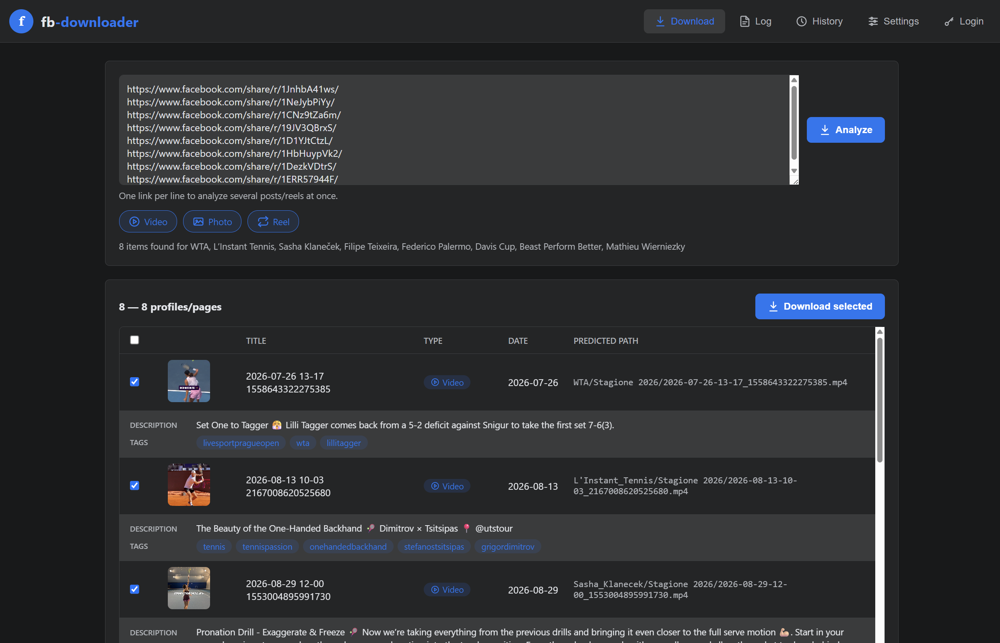
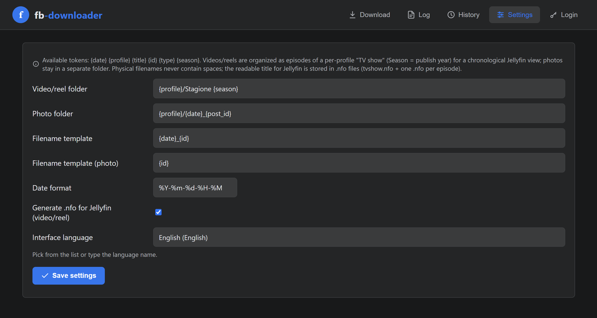
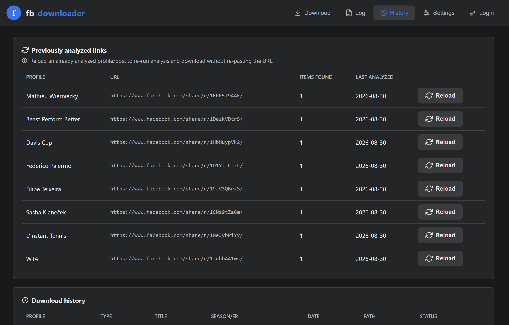
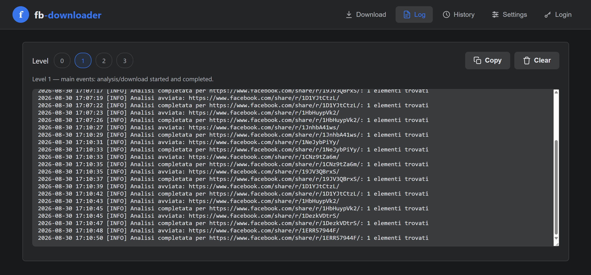

# fb-downloader

Self-hosted app for downloading videos, photos and reels from Facebook
(profiles, posts, or direct links), with a Facebook-themed web UI,
configurable naming, and output organized for Jellyfin as a **TV show
per profile**.

## Screenshots

<!--
  Replace the placeholders below with real screenshots once you have
  them (see "Adding your own screenshots" further down). GitHub renders
  images directly from the repo once they're committed under
  screenshots/ — no external hosting needed.
-->

| Download | Settings |
|---|---|
|  |  |

| History | Logs |
|---|---|
|  |  |

## Stack

- FastAPI (backend + API) + SQLite (download history, deduplication)
- yt-dlp (video/reel) + gallery-dl (photo albums, profile fallback)
- FFmpeg (video remuxing)
- Static web UI (HTML/CSS/JS, Facebook-style theme, built-in SVG icons)
- Docker Compose

## Quick start

```bash
cp .env.example .env
# edit OUTPUT_ROOT and PHOTO_OUTPUT_ROOT in .env (the paths on your NAS/host)
# do NOT change the right side of the volume or the MEDIA_ROOT variable in
# docker-compose.yml: they must stay identical to each other, including case.

docker compose up -d --build
```

Web UI at `http://<host>:9797` (default port; change it via `APP_PORT` in your `.env`).

Only `APP_PORT`, `OUTPUT_ROOT`, `PHOTO_OUTPUT_ROOT`, `ADMIN_USERNAME` and
`ADMIN_PASSWORD` are
real `.env` variables read by the container. Naming templates, date
format, NFO generation, and interface language are configured from the
**Settings** tab in the web UI (persisted in SQLite) — not from `.env`.

## Facebook login (mode B — cookies only, never a password)

1. Sign in to facebook.com in your normal browser.
2. Export your session cookies in Netscape format (e.g. the
   "Get cookies.txt LOCALLY" browser extension).
3. In the **Login** tab of the app, select the `cookies.txt` file — it uploads automatically as soon as you pick it, no separate "upload" button.

The app never asks for or stores a password. The cookie needs to be
renewed when the Facebook session expires.

## Naming — physical vs. Jellyfin

- **Physical name** (file/folder on disk): publish date-time + Facebook
  ID only (e.g. `2026-08-19-14-32_987654321.mp4`) — no post text, never
  contains spaces, underscore as separator.
- **Jellyfin metadata**: videos/reels are organized as episodes of a TV
  show, one Facebook profile = one show:
  - `tvshow.nfo` in the profile folder (readable show title)
  - `poster.jpg` in the profile folder, best-effort downloaded from the
    Facebook profile picture via the public `graph.facebook.com/{id}/picture`
    endpoint — tries, in order, the numeric profile/page ID (when yt-dlp
    exposes it, which is rare) and the page's vanity username extracted
    from the URL itself (e.g. `TennisPowerAcademy360`, more reliable for
    public Pages); silently skipped if neither works, and never
    overwrites an existing poster
  - `fanart.jpg` in the profile folder, best-effort: **not** the real
    Facebook cover photo (that requires authenticated Graph API access
    with special permissions, not obtainable via simple scraping) — uses
    the thumbnail of the first downloaded video/reel as a substitute
    background instead. Skipped if no thumbnail is available; never
    overwrites an existing fanart.
  - no `logo.png` is generated: Facebook has no equivalent of a
    transparent clear-logo image separate from the profile picture, so
    there's nothing meaningful to fetch for it
  - one `.nfo` per episode next to each video/reel:
    - `<title>`: publish date-time + Facebook ID (e.g. "2026-08-16 23-50
      2128650394390172"), human-readable, no underscores — those only
      exist in the physical filename
    - `<plot>`: the post's caption, **with hashtags automatically
      stripped out** (Facebook doesn't expose a separate tags field —
      hashtags live inside the caption text itself, so they're extracted
      from there)
    - `<tag>`: one for the media type (video/reel) + one per hashtag
      extracted from the caption (plus any tag yt-dlp exposes natively,
      when available)
  - **photos go to a completely separate root folder** (`PHOTO_OUTPUT_ROOT`,
    see below) — not a subfolder of the video root — with no NFO and no
    show/season data at all: just `{profile}/{date}_{id}.jpg`

Templates are configurable from the **Settings** tab, available tokens:
`{date} {profile} {title} {id} {type} {season}` (`{title}` — the post's
raw text — remains available for custom templates even though the
default filename no longer uses it).

Defaults:
- Video/reel folder (under `OUTPUT_ROOT`): `{profile}/Stagione {season}`
- Video/reel file: `{date}_{id}`
- Photo folder (under the separate `PHOTO_OUTPUT_ROOT`): `{profile}/{date}_{post_id}`
  — grouped by POST (publish date-time + the post's own Facebook ID), so
  every photo from the same post/album shares one folder instead of each
  getting its own
- Photo file: `{id}` — the individual photo's Facebook ID (gets a `-2`,
  `-3`... suffix when multiple photos in the same post would otherwise
  share the same ID), replacing the long unreadable CDN-derived filename
  gallery-dl would otherwise use (e.g. `scontent.xx.fbcdn.net_..._n.jpg`
  becomes `1048354527550528.jpg`)
- Date format: `%Y-%m-%d-%H-%M` (includes time; dashes only, no colons —
  colons aren't valid in filenames on several filesystems)

## Output structure (example)

Videos/reels (`OUTPUT_ROOT`, default `/media/facebook`):

```
/media/facebook/
└── Mario_Rossi/
    ├── tvshow.nfo
    ├── poster.jpg
    ├── fanart.jpg
    ├── Stagione 2026/
    │   ├── 2026-08-19-14-32_987654321.mp4
    │   ├── 2026-08-19-14-32_987654321.nfo
    │   ├── 2026-08-17-09-05_555444333.mp4
    │   └── 2026-08-17-09-05_555444333.nfo
    └── Stagione 2025/
        └── ...
```

Photos (`PHOTO_OUTPUT_ROOT`, default `/media/facebook-photos` — a
completely separate folder tree, not nested under the video root). Every
photo from the same post shares one folder (grouped by publish date-time
+ post ID); a single photo post gets the same treatment, just with one
file inside. Multiple photos in the same folder are numbered `-2`, `-3`,
etc. (each keeping its own original file extension, since not all photos
are necessarily `.jpg`):

```
/media/facebook-photos/
└── Mario_Rossi/
    ├── 2026-08-15-18-40_111222333/
    │   └── 111222333.jpg
    └── 2026-08-16-23-50_444555666/
        ├── 444555666-1.jpg
        ├── 444555666-2.jpg
        └── 444555666-3.png
```

## Jellyfin configuration

Create **two separate libraries**, each pointed at its own dedicated root
folder — they no longer share any part of the folder tree:

1. **Content type: TV Shows**, pointed at `OUTPUT_ROOT`
   (`/media/facebook` by default) — automatically picks up each profile's
   `Stagione NNNN/` subfolders as seasons of a show, with episodes
   sortable by air date (`aired`) instead of episode number. Disable
   TheMovieDB (or any other online provider) and leave only the local
   **Nfo** provider enabled, so Jellyfin doesn't try to match the profile
   name against a real TV series.
2. **Content type: Photos**, pointed at `PHOTO_OUTPUT_ROOT`
   (`/media/facebook-photos` by default) — a plain folder of images per
   profile, no NFO, no show/season concept involved at all.

In both libraries, enable **real-time monitoring** of folder changes, so
new downloads show up without a manual scan.

## Interface language

In **Settings**, the "Interface language" field: pick from the dropdown
or type freely (by code, English name, or native name — e.g. "it",
"Italian", or "Italiano" all resolve to the same result). The list covers
European languages, Japanese, Chinese (simplified/traditional), Korean,
and many other world languages, based on the languages supported by
Google Translate.

**Default: English.** Full interface translation available for: English,
Italian, French, German, Spanish, Portuguese, Japanese, Simplified
Chinese, Korean, Russian, Romanian, Polish, Norwegian, Swedish. Other
languages in the list are selectable and the preference is saved, but the
interface stays in English until a full translation is added (a notice in
Settings flags this) — deliberately, instead of showing low-quality
machine translations for the ~90 remaining languages.

## Web UI authentication

HTTP Basic protection (native browser prompt, no custom login page).
**Disabled by default** — if `ADMIN_PASSWORD` is empty in your `.env`,
the app stays open as before. To enable it:

```bash
# in your .env
ADMIN_USERNAME=admin
ADMIN_PASSWORD=a-password-of-your-choice
```

`docker compose up -d --build` to apply. `/api/health` always remains
reachable without credentials (used by the Docker healthcheck).

## Download queue

Downloads happen in the background: `POST /api/download` queues the
selected items and returns immediately (it doesn't block the HTTP
request, even for hundreds of posts). The web UI shows a "Queued / in
progress" panel with automatic polling every 2 seconds until the queue is
empty. Two workers process the queue in parallel (configurable in
`app/queue_worker.py`, `WORKER_COUNT` constant).

## Analysis is also asynchronous

Analyzing a profile/page with many posts (e.g. a whole month) means
yt-dlp has to query every single item — this can take minutes. `POST
/api/analyze` starts the analysis in the background and returns
immediately with a `job_id`; the web UI polls `GET /api/analyze/{job_id}`
every 2 seconds until it's done, so the browser never blocks or times
out waiting for a slow profile to finish analyzing. Analysis jobs live in
memory only (no DB persistence needed — they're short-lived) and are
discarded after 30 minutes.

## In-app logs

The **Log** tab shows an in-memory log of what the app is doing, with a
level selector (0–3):

- **0** — errors only
- **1** — main events (analysis/download started/completed) — default
- **2** — technical detail (yt-dlp/gallery-dl commands, retries)
- **3** — everything, including the **full raw output** of yt-dlp/gallery-dl
  for each analysis — the most useful level when debugging a link that
  won't analyze correctly, at the cost of verbosity

The level is a threshold: only messages at or below the selected level
are recorded, not just displayed — raise it before reproducing an issue,
lower it back down afterwards. Logs live **in memory only** (last ~2000
lines) and are lost on container restart; `docker compose logs
fb-downloader` remains the way to see anything from before this feature
or after a restart. A **Copy** button copies everything currently shown
to the clipboard in one click, and a **Clear** button empties the buffer.

## Cookie expiry

The Netscape cookie format includes the expiry date for each cookie: the
app reads it directly from the uploaded file (no test request to
Facebook). If the session is expired or expires within 3 days, a warning
banner appears at the top of the app, in any tab.

## Deduplication / re-download

Every media item is tracked in SQLite via its Facebook post ID (`fb_id`,
unique column). In the analysis preview, already-downloaded items appear
**unchecked** by default. Selecting them explicitly and pressing "Download
selected" forces a RE-download: the existing file (and, for videos/reels,
its `.nfo`) is cleaned up before regenerating it from scratch — only that
specific file, never the whole folder, since photo folders are shared
between multiple photos from the same post and removing the folder would
also delete sibling photos not selected for re-download.

## Known limitations

- Facebook frequently changes its markup: the yt-dlp/gallery-dl
  extractors can break and may need updating
  (`pip install -U yt-dlp gallery-dl` in the image).
- yt-dlp only recognizes direct links to a single video/reel/post, not a
  "bare" profile/page link; for profiles, the gallery-dl fallback works,
  mainly for photos.
- Private content requires valid session cookies.
- Respect Facebook's Terms of Service and the rights over the content you
  download.

## Possible future work (not included in this scaffold)

- Dedicated login page instead of HTTP Basic (useful if multiple users
  with different permissions are needed in the future)
- Push/email notification (not just an in-app banner) when cookies expire
- Full translations for the remaining languages in the picker
